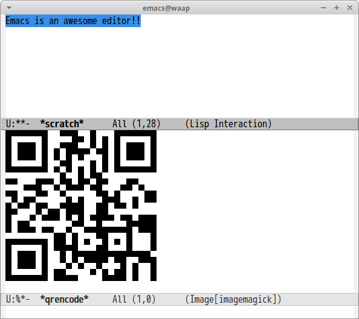

# qrencode

[libqrencode](https://fukuchi.org/works/qrencode/) binding of Emacs Lisp.

## Screenshot

## Interfaces

#### `(qrencode string &optional scale)`

Encode `string` to QRCode.

#### `M-x qrencode-region`

Encode region string to QRCode.
